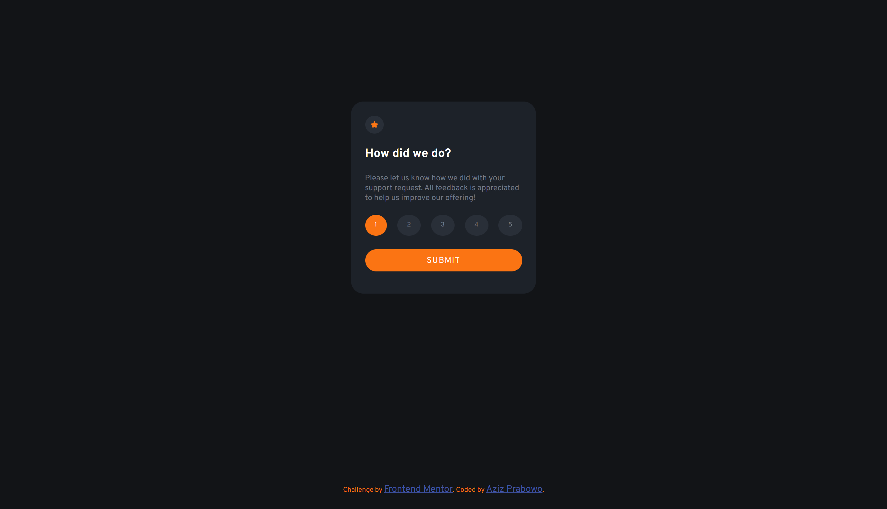

# Frontend Mentor - Interactive rating component solution

This is a solution to the [Interactive rating component challenge on Frontend Mentor](https://www.frontendmentor.io/challenges/interactive-rating-component-koxpeBUmI). Frontend Mentor challenges help you improve your coding skills by building realistic projects.

## Table of contents

- [Overview](#overview)
  - [The challenge](#the-challenge)
  - [Screenshot](#screenshot)
  - [Links](#links)
- [My process](#my-process)
  - [Built with](#built-with)
  - [What I learned](#what-i-learned)
- [Author](#author)

## Overview

### The challenge

Users should be able to:

- View the optimal layout for the app depending on their device's screen size
- See hover states for all interactive elements on the page
- Select and submit a number rating
- See the "Thank you" card state after submitting a rating

### Screenshot



### Links

- Solution URL: [SOLUTION](https://www.frontendmentor.io/solutions/interactive-rating-component-using-vanilla-js-jZWcbKKffT)
- Live Site URL: [LIVE SITE](https://azizp128.github.io/Interactive-Rating-Component/)

## My process

### Built with

- Semantic HTML5 markup
- CSS custom properties
- Flexbox
- Mobile-first workflow
- Vanilla JS

### What I learned

I learned about how to create JS active elements on hover in this challenge.

See the code snippets below:

```js
cardRating.addEventListener("click", function (e) {
  rating.forEach((r) => {
    r.className = "rating";
  });

  if (e.target.classList == "rating") {
    e.target.classList.add("active");
  }

  cardStateRate.innerHTML = e.target.innerHTML;
  cardStateRate.style.fontSize = "0.7rem";
});

submitBtn.addEventListener("click", (e) => {
  cardTwo.style.display = "block";
  cardOne.style.display = "none";
});
```

## Author

- Frontend Mentor - [@azizp128](https://www.frontendmentor.io/profile/azizp128)
- Twitter - [@azizprbw](https://www.twitter.com/azizprbw)
